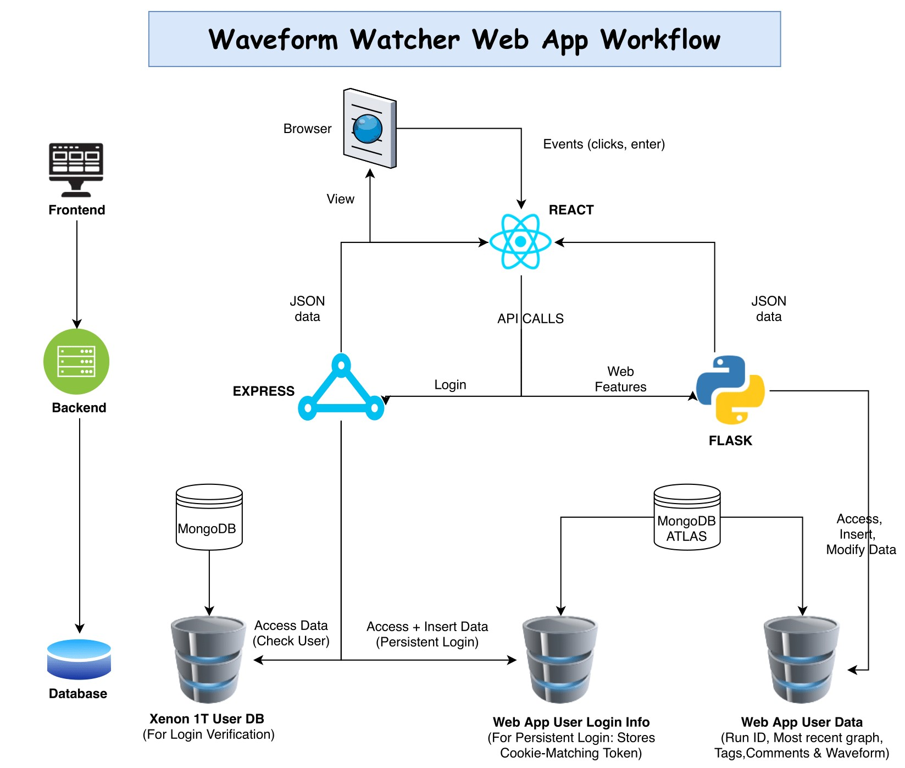
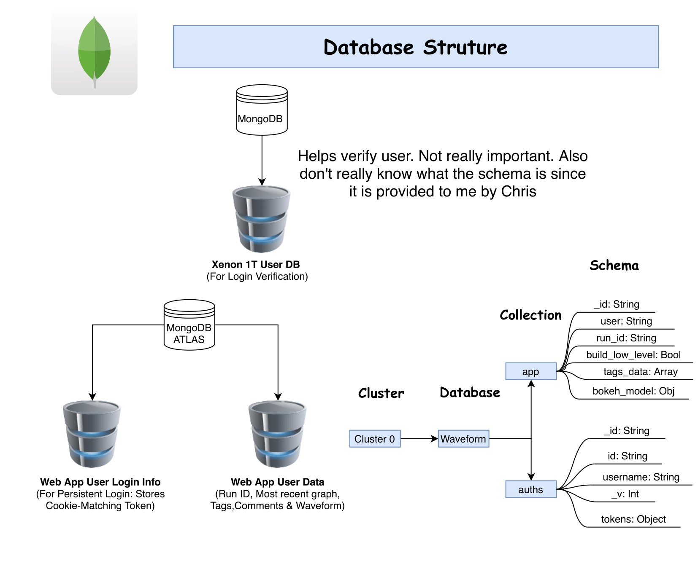

# Waveform-Watcher

A web app developed to visualize and analyze waveform data collected from XENON1T and XENONnT experiment. You can [view the website here](https://waveform-watcher.azurewebsites.net/). Access restricted to only [XENON1T](https://github.com/XENON1T) and [XENONnT](https://github.com/XENONnT) organization.

## The Login Page

## The Main Page

## Main Features

* Get new waveform based on run ID and build level
* Create tag and enter comments to annotate a specific waveform
* Save a tag and comments with a waveform
* Delete a tag and therefore the comments and waveform with it
* Pan and view different parts of the visualization
* Box zoom in and out of the visualization
* Wheel zoom on x-axis
* Save the visualizations locally
* Interaction is synced between the first 2 graphs and between the last 2 graphs \(e.g if you box zoom in the first graph, the second graph will do the same\)

## Run on Local Machine

You will need key environmental variables. Ask the repo owner for them before you try running the app locally.

### Run with Docker Containers

1. Clone this repo with `git clone https://github.com/cheryonthetop/waveform-watcher.git` to your local machine or download as zip file
2. Install [Docker Desktop](https://www.docker.com/products/docker-desktop)
3. cd into /client
4. Run `docker build -t client` .
5. cd into /server
6. Run `docker build -t server` .
7. cd into /flask
8. Run `docker build -t flask` .
9. Run the separate docker containers with
10. `docker run --it -p 3000:3000 client`
11. `docker run --it -p 5000:5000 server`
12. `docker run --it -p 4000:4000 flask`
13. Go to [http://localhost:3000](http://localhost:3000) on the browser

### Run without Docker Containers

1. Install [node](https://nodejs.org/en/download/) and [python](https://www.python.org/downloads/). Note these come with the needed package managers `npm` and `pip`. So there is no need for separte installations.
2. cd into /client
3. Run `npm install`
4. cd into /server
5. Run `npm install`
6. Run `npm run dev`
7. cd into /flask
8. Run `pip install -r requirements.txt`

## The structure and workflow of the app

   

