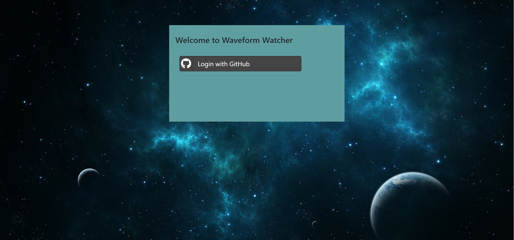
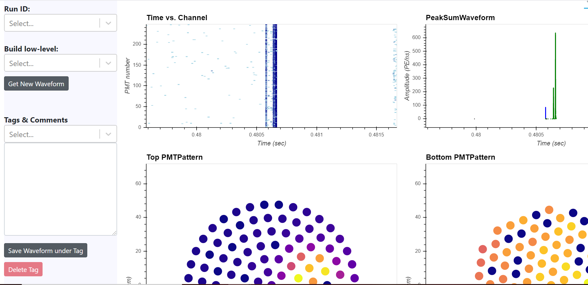
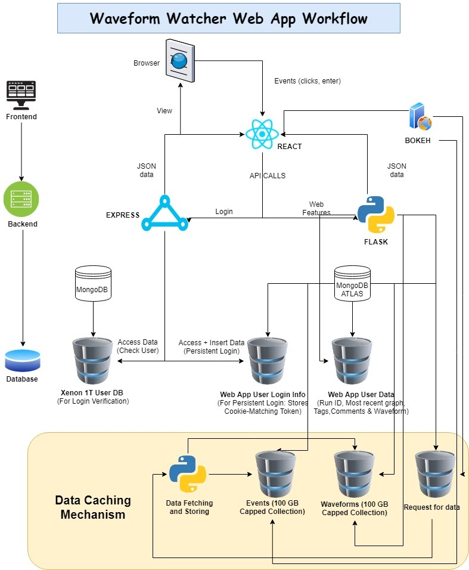

# Waveform-Watcher

A web app developed to visualize and analyze waveform data collected from XENON1T and XENONnT experiment. You can [view the website here](https://waveform-watcher.azurewebsites.net/). Access restricted to only [XENON1T](https://github.com/XENON1T) and [XENONnT](https://github.com/XENONnT) organization.

## The Login Page

## The Main Page

## Main Features

- Get new waveform based on run ID and build level
- Create tag and enter comments to annotate a specific waveform
- Save a tag and comments with a waveform
- Delete a tag and therefore the comments and waveform with it
- Pan and view different parts of the visualization
- Box zoom in and out of the visualization
- Wheel zoom on x-axis
- Save the visualizations locally
- Interaction is synced between the first 2 graphs and between the last 2 graphs \(e.g if you box zoom in the first graph, the second graph will do the same\)

## Run on Local Machine

You will need key environmental variables. Ask the repo owner for them before you try running the app locally.

### Run all apps at once

Ask the owner for a bat file that sets up the environment variable and starts all the apps at once. The bat file is not included in the repo because it contains a secret key for an environmental variable. If you work on a Mac or Linux machine, the similar can be achieved with a bash or shell script. The bat file is only for Windows but can still be a good reference if you decide to write your own script.

### Run without Docker Containers

1. Install [node](https://nodejs.org/en/download/) and [python](https://www.python.org/downloads/). Note these come with the needed package managers `npm` and `pip`. So there is no need for separte installations.
2. cd into /client
3. Run `npm install`
4. cd into /node-server
5. Run `npm install`
6. Run `npm run dev`
7. cd into /flask-server
8. Run `pip install -r requirements.txt`
9. Run `python index.py`
10. cd into /bokeh-server
11. Run `pip install -r requirements.txt`
12. Run `bokeh serve --allow-websocket-origin=* .`
13. Go to [http://localhost:3000](http://localhost:3000) on the browser
    s

### Run with Docker Containers (Not Recommended for Local Dev)

1. Clone this repo with `git clone https://github.com/cheryonthetop/waveform-watcher.git` to your local machine or download as zip file
2. Install [Docker Desktop](https://www.docker.com/products/docker-desktop)
3. cd into /client
4. Run `docker build -t client` .
5. cd into /node-server
6. Run `docker build -t server` .
7. cd into /flask-server
8. Run `docker build -t flask` .
9. cd into /bokeh-server
10. Run `docker build -t bokeh` .
11. Run the separate docker containers with
12. `docker run --it -p 3000:3000 client`
13. `docker run --it -p 5000:5000 server`
14. `docker run --it -p 4000:4000 flask`
15. `docker run --it -p 5006:5006 bokeh`
16. Go to [http://localhost:3000](http://localhost:3000) on the browser

## The structure and workflow of the app

## Documentation

For more info, read the documentation [here](https://yc104.gitbook.io/waveform-watcher/)
